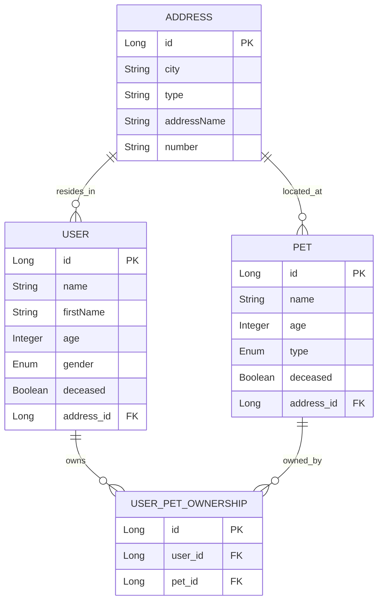

# BNP User Pet Manager

A **Spring Boot** application for managing **Users**, **Pets**, and their **Ownership relationships** with:
- Address de-duplication
- Concurrency-safe updates (pessimistic locking with retry)
- Centralized exception handling
- Request `traceId` logging for troubleshooting

---

## 📌 API Design Choices

### **RESTful Principles**
- **Resource-based URLs** (`/users`, `/pets`, `/ownerships`) clearly represent entities.
- **HTTP verbs** reflect the operation type:
  - `POST` → Create
  - `PUT` → Full update (with pessimistic locking)
  - `PATCH` → Partial update (e.g., mark as deceased)
  - `GET` → Query
- **Stateless interactions** – All state is persisted in the database, no in-memory session data.

### **Address De-Duplication**
- Implemented at the **service layer** to avoid duplicates before persistence.
- Ensures **unique addresses** using database constraints.

### **Pessimistic Locking + Retry**
- Prevents lost updates under concurrent modification.
- Uses **Spring Retry** to transparently retry when lock conflicts occur.
- **Exponential backoff** (50ms → 100ms → 200ms) balances performance with contention handling.

### **Trace ID in Responses**
- Every request generates a `traceId` added to:
  - **Logs** (via MDC)
  - **HTTP Response header**
  - **Error response bodies**
- Enables easy correlation between client-side errors and server logs.

### **Centralized Exception Handling**
- One place (`GlobalExceptionHandler`) to handle all errors.
- Maps exceptions to **meaningful HTTP statuses** with consistent JSON error format.

---

## 🛠 Technology Stack & Justifications

| Technology | Purpose | Why Chosen |
|------------|---------|------------|
| **Spring Boot** | Application framework | Rapid setup, convention-over-configuration |
| **Spring Data JPA** | ORM & repository abstraction | Reduces boilerplate, integrates with Hibernate |
| **Hibernate** | ORM implementation | Mature, widely used, supports pessimistic locking |
| **Spring Retry** | Automatic retry on transient failures | Clean declarative retries without manual looping |
| **Jakarta Validation** | Input validation | Standard annotations for field validation |
| **Lombok** | Boilerplate reduction | Generates getters/setters/builders automatically |
| **SLF4J + Logback** | Logging framework | Industry standard logging, flexible formats |
| **Logstash Encoder** | JSON log output | Structured logs for easy search in ELK stack |
| **JUnit + Mockito** | Testing | Unit + integration testing with mocking |

---

## 🚀 Running the Application

```bash
mvn clean install
mvn spring-boot:run
```

Application runs at:
```
http://localhost:8080/api/v1/
```

## 🧭 Swagger / OpenAPI (testing)

- **Swagger UI:** `http://localhost:8080/api/v1/swagger-ui/index.html`
- **OpenAPI JSON:** `http://localhost:8080/api/v1/api-docs`

---

## 📜 Key API Endpoints

### **User**
- `POST /users` → Create user
- `PUT /users/{id}` → Update with retry
- `PATCH /users/{id}/death` → Mark as deceased
- `GET /users/by-name?name=...&firstName=...`

### **Pet**
- `POST /pets` → Create pet
- `PUT /pets/{id}` → Update with retry
- `PATCH /pets/{id}/death` → Mark as deceased

### **Ownership**
- `POST /ownerships` → Link user and pet
- `GET /ownerships/pets-by-user`
- `GET /ownerships/pets-by-city`
- `GET /ownerships/users-by-pet-type-and-city`
- `GET /ownerships/pets-by-women-in-city`

---

## 📦 Example Error Response with Trace ID

```json
{
  "traceId": "c53d12e1-bbd9-41f0-8c5f-2cf91590cb85",
  "message": "User not found: 42"
}
```

---

## 🧪 Testing

```bash
mvn test
```
Covers:
- Controllers (MockMvc)
- Services (business logic + retry behavior)
- Exception handling
- TraceIdFilter behavior
- Utility methods (traceId retrieval)

---

## 🗄️ Database ER Diagram & Justification

Below is the **Entity-Relationship (ER)** diagram for the system:



**Design Justification:**  
- **Address** is a separate table to enable **de-duplication** of locations (users/pets at same address share the same record).  
- **User** and **Pet** are distinct entities to handle independent lifecycle (pets can be transferred, users can move).  
- **UserPetOwnership** is a **many-to-many** join table allowing multiple owners for a pet and multiple pets for a user.  
- **Enums** (`Gender`, `PetType`) ensure controlled values, preventing invalid data entries.  
- **Soft delete** is implemented using the `deceased` boolean to maintain history without removing records.
